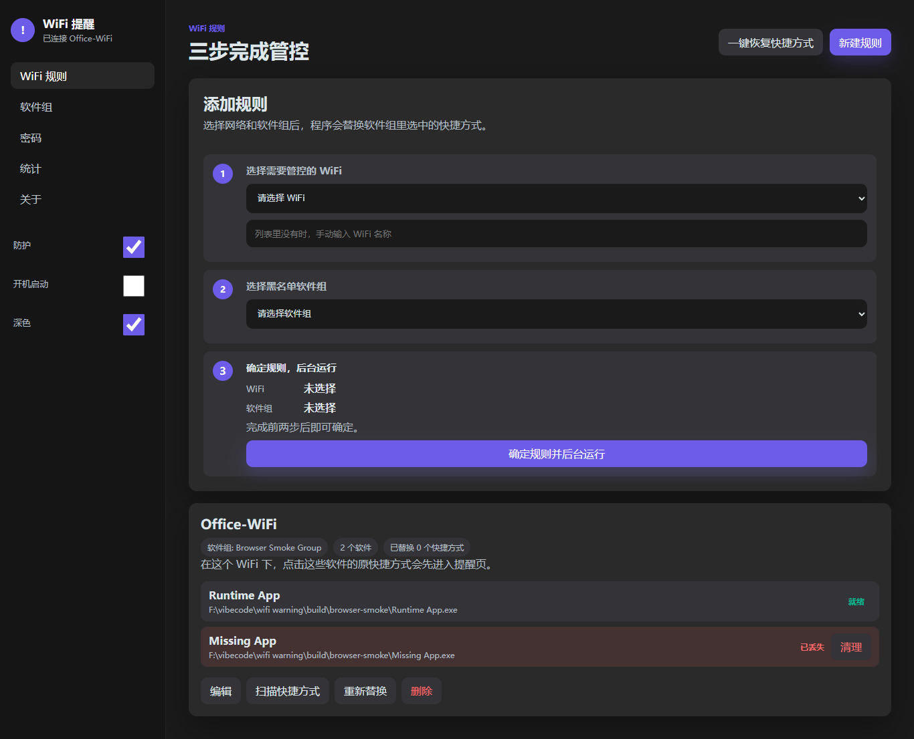
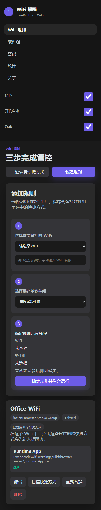
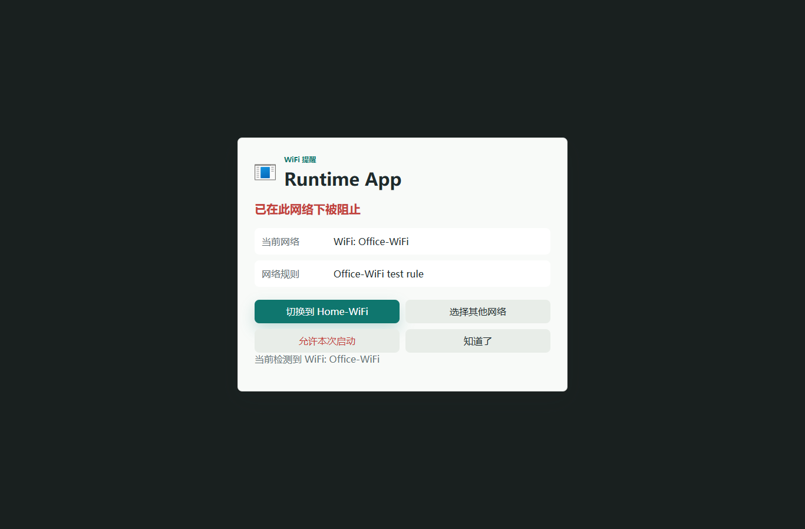
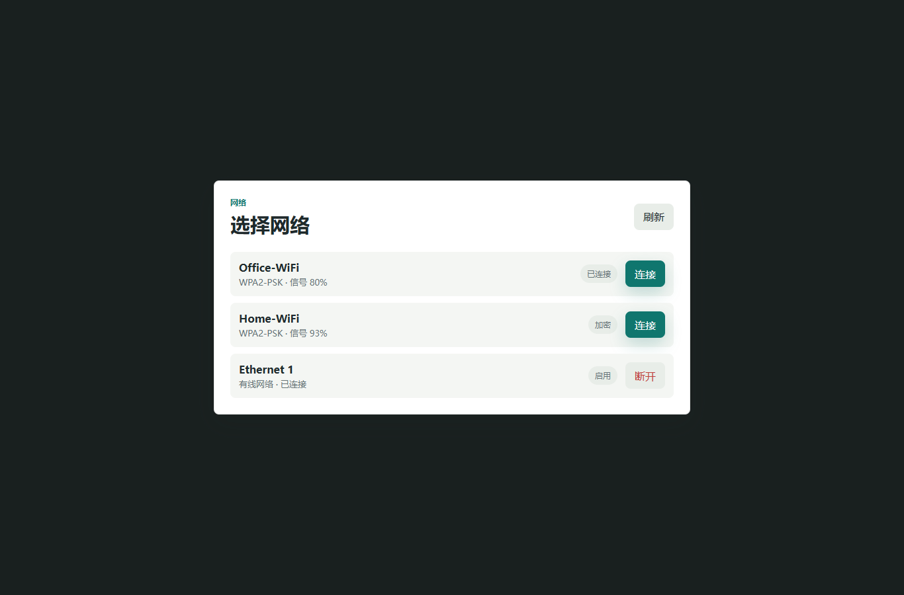

# WiFi Warning

WiFi Warning is a lightweight Windows tray app that shows a warning page before selected app shortcuts open on specific WiFi networks.

It is useful when you want a small friction point for distracting apps at school, work, a cafe, or any network where you want a different software routine. Pick a WiFi, pick a shortcut group, confirm the rule, and keep the app running in the background.



## Highlights

- **Three-step setup**: choose the WiFi, choose a software group, confirm the rule.
- **Shortcut-based blocking**: keeps the same shortcut name, icon, and location, but routes launches through `ww-launch.exe`.
- **One-click restore**: restore all replaced shortcuts from the settings page or `restore-shortcuts.cmd`.
- **Portable first**: no installer required; unzip and run.
- **Local only**: configuration UI is served on localhost and data stays under the current Windows user profile.
- **Small footprint**: current runtime smoke test reports about **3.97 MiB** working set.

## Download

Download the portable package from GitHub Releases:

[Latest release](https://github.com/SSRYLJRSS/wifi-warning/releases/latest)

The same portable zip is also kept in this repository for convenience:

[release/WiFiWarning-portable.zip](release/WiFiWarning-portable.zip)

After extracting, run:

```powershell
.\wifi-warning.exe
```

To start in the background:

```powershell
.\start-minimized.cmd
```

To restore all tracked shortcuts before deleting the folder:

```powershell
.\restore-shortcuts.cmd
```

## Screenshots

### Settings


### Mobile Layout



### Warning Page



### WiFi Picker



## How It Works

WiFi Warning does not terminate processes and does not modify target applications.

Instead, it replaces the selected `.lnk` shortcut target with the bundled launcher:

```text
Original shortcut -> ww-launch.exe -> WiFi rule check -> warning page or original app
```

The original shortcut is copied to:

```text
%APPDATA%\WiFiWarning\shortcut-backups
```

This keeps backup files away from the Desktop and Start Menu, avoiding visible `.lnk.backup` files and reducing Explorer refresh flicker.

## Tutorial

### 1. Open Settings

Run `wifi-warning.exe`. The tray app starts a local settings page.

If the browser does not open automatically, visit:

```text
http://localhost:18765/settings
```

### 2. Create a Software Group

Open **Software Groups** from the left navigation.

Click **New Software Group**, name it, then click **Choose Shortcuts**. Select the `.lnk` shortcuts you want WiFi Warning to control.

The app reads the shortcut target and stores the original shortcut path. When a rule is active, the shortcut keeps the same file name, icon, and location.

### 3. Create a WiFi Rule

Open **WiFi Rules**.

Follow the three steps:

1. Choose the WiFi network to control.
2. Choose the software group.
3. Confirm the rule and let the tray app run in the background.

### 4. Launch a Controlled Shortcut

When you click a controlled shortcut while connected to the matching WiFi, WiFi Warning opens a warning page.

You can:

- stop and go back,
- switch WiFi if available,
- enter the password to allow only this launch.

Password bypass is intentionally one-time only. There is no global countdown bypass.

### 5. Restore Shortcuts

Use **One-click restore shortcuts** in settings, or run:

```powershell
.\restore-shortcuts.cmd
```

Restore failures keep their records so you can retry later.

## Build From Source

Requirements:

- Windows
- Git
- CMake with a C++17-capable compiler, or MinGW available in `PATH`
- Node.js for frontend syntax checks and browser smoke tests

Build with MinGW:

```powershell
.\scripts\build-mingw.ps1
```

Package portable zip:

```powershell
.\scripts\package-portable.ps1
```

Run the full local acceptance suite:

```powershell
.\scripts\local-acceptance.ps1
```

The portable zip is written to:

```text
build\dist\WiFiWarning-portable.zip
```

## Project Layout

```text
src/core/        Core config, logging, WiFi, rules, shortcuts
src/ui/          Local HTTP server, API handlers, tray icon
src/ww-launch/   Small launcher used by replaced shortcuts
frontend/        Settings, warning page, WiFi picker
scripts/         Build, package, smoke, acceptance scripts
tests/           Native smoke tests
docs/            Reports and screenshots
release/         Portable zip for GitHub upload
```

## Validation Status

Last local acceptance run passed on 2026-06-09:

- `build-mingw`
- `ww-smoke`
- `runtime-smoke`
- `tray-smoke`
- `browser-smoke`
- `validate-cmake`
- PowerShell parser checks
- Node `--check`
- `package-portable`

Runtime smoke measured about **3.97 MiB** working set, below the 5 MiB target.

## Notes

- Configuration and logs are stored in `%APPDATA%\WiFiWarning`.
- The settings service binds to loopback only.
- This repository intentionally publishes the portable version only. Installer scripts are not included in the portable package.

## License

No license has been declared yet.
